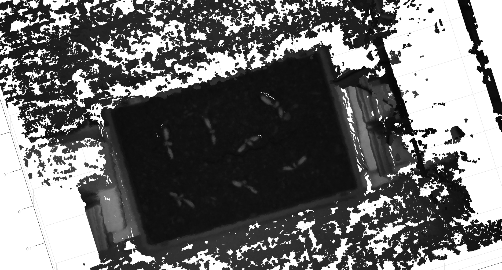
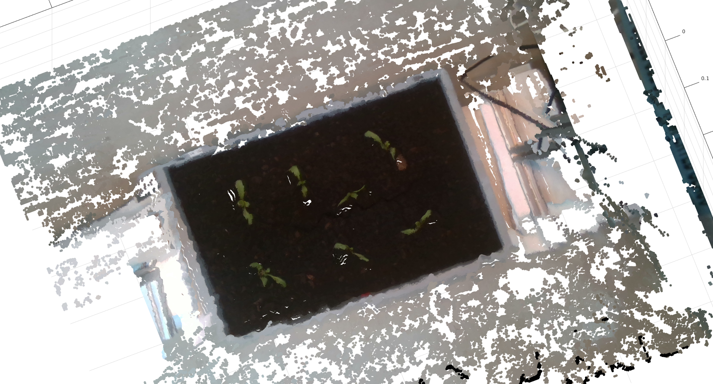

# Plant Stress Phenotyping
## Computer Vision based crop phenotyping routines

### Authors
>Raghav Khanna  
>Lukas Schmid  
Autonomous Systems Lab  
ETH Zurich

### Contribute

1. Fork or branch
2.  Please adhere to the following [styleguide](https://sites.google.com/site/matlabstyleguidelines/documentation)
3. Send a PR and tag me

### Citation

If you find this repository useful in your scientific work, please consider citing

>A Spatio Temporal Spectral Dataset for Plant Stress Phenotyping by Khanna, Raghav and Schmidt, Lukas and Nieto, Juan and Siegwart, Roland and Liebisch, Frank
>A Bayesian Framework for Plant Stress Phenotyping by Raghav Khanna, Lukas Schmid, Juan Nieto and Frank Liebisch

### Example (run *demo.m*)
For Realsense ZR300 stereo reconstruction and color reprojection
```
% Calibrate cameras
realsenseParams = calibratecameraarray(3, 50);

% The following are still WIP

% Create 3D point clouds
pointcloudArray = stereoreconstruction(realsenseParams{1});

% Color point clouds using RGB images
colorPointcloudArray = colorpointcloud(realsenseParams{2});

% Visualise a pointcloud
displayboxpointcloud(colorPointcloudArray{1});

% Estimate Canopy Cover from RGB images
canopyCoverArray = estimatecanopycover();

% Estimate plant height from color pointclouds
plantHeightArray = estimateplantheight(colorPointcloudArray)
```

### Functions

#### calibratecameraarray

>Calibrate a set of N cameras given synchronised images of a checkerboard in different positions.
Accepts RGB or grayscale images which may be taken from cameras sensitive to different wavelength bands as long as the checkerboard corners are visible in the images.

>Sample Usage for calibrating 3 cameras imaging a checkerboard with a square size of 50mm:
```
calibParams = calibratecameraarray(3, 50);
```

#### stereoreconstruction

>Takes a set of pair of synchronised images and calibration parameters from a stereo camera pair and returns a point cloud array (and depth image) of the 3D scene.


#### colorpointcloud

>Takes pointclouds and (color) images along with camera calibration parameters to return a coloured point cloud of the scene.


#### cropMask.m
TODO
>Takes a color image and returns a black and white image with white representing "green" crops based on the Excess Green Index/ Normalised Difference Vegetation Index, Otsu's method for thresholding and region growing. 
>Current (first guess) version performs thresholding based on non-normalized EGI, using a fixed value.

#### script_detect_box_rgb.m
>Tries to find the inner border of the box in all 30 rgb images of the selected dataset by projecting rays onto the edges of the box. Note down wrong angle detections and run again in manual mode to update these boxes. The detected boxes can then be stored in the box_rectangle_Set.mat (a cell-array where box_rectangle_set{i} contains a 30x5 Matrix with the rectangle for every image). To crop box Nr. j use cropboxfromimage(rgb_image,box(j,:)). The box_rectangle_Set indices are according to the date of the measurement, index 1 being 18.1 up to 13 being 5.3.

#### script_evaluate_measurment_set.m
>builds a 3D pointcloud for the selected dataset, then chooses only crop points based on the RGB image, which has been processed with 'cropmask.m'. Estimates height and NDVI values from this pointcloud. Computes canopy cover from masked RGB image.
